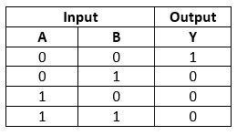

# MUX2 VHDL Design

This project provides a VHDL implementation of a 3-input multiplexer (MUX2) using two 2-input multiplexers (MUX components). The design can be used as a building block in more complex digital circuits. This README file will guide you through the understanding and usage of the MUX2 entity in VHDL.

## File Structure

* `MultiplexerOne.vhd`: Contains the VHDL code for the MUX1 entity.
* `MultiplexerTwo.vhd`: Contains the VHDL code for the MUX2 entity.
* `README.md`: This README file, providing an overview and explanation of the code.

## Description

The `MUX2` entity is designed to select one of three input signals (`D0`, `D1`, or `D2`) based on two selection lines (`S0` and `S1`). The output of the multiplexer is provided on the `Y1` port

<h2>NOR Gate</h2>

This Complex Circuit Show NOR Gate

### Entity Declaration

<pre>

vhdl
<button class="flex gap-1 items-center"><svg xmlns="http://www.w3.org/2000/svg" width="24" height="24" fill="none" viewBox="0 0 24 24" class="icon-sm"><path fill="currentColor" fill-rule="evenodd" d="M7 5a3 3 0 0 1 3-3h9a3 3 0 0 1 3 3v9a3 3 0 0 1-3 3h-2v2a3 3 0 0 1-3 3H5a3 3 0 0 1-3-3v-9a3 3 0 0 1 3-3h2zm2 2h5a3 3 0 0 1 3 3v5h2a1 1 0 0 0 1-1V5a1 1 0 0 0-1-1h-9a1 1 0 0 0-1 1zM5 9a1 1 0 0 0-1 1v9a1 1 0 0 0 1 1h9a1 1 0 0 0 1-1v-9a1 1 0 0 0-1-1z" clip-rule="evenodd" data-darkreader-inline-fill=""></path></svg>Copy code</button>

<code class="!whitespace-pre hljs language-vhdl">library IEEE;
use IEEE.std_logic_1164.all;

entity MUX2 is
    Port (
        D0, D1, D2, S0, S1 : in  std_logic;
        Y1                 : out std_logic
    );
end MUX2;
</code>

</pre>

### Architecture

The architecture of the MUX2 entity consists of two levels of 2-input multiplexers.

1. **First Level MUX** : This level selects between `D0` and `D1` based on the selection line `S0`.
2. **Second Level MUX** : This level selects between the output of the first level MUX (`MUX1_Result`) and `D2` based on the selection line `S1`.

<pre>

vhdl
<button class="flex gap-1 items-center"><svg xmlns="http://www.w3.org/2000/svg" width="24" height="24" fill="none" viewBox="0 0 24 24" class="icon-sm"><path fill="currentColor" fill-rule="evenodd" d="M7 5a3 3 0 0 1 3-3h9a3 3 0 0 1 3 3v9a3 3 0 0 1-3 3h-2v2a3 3 0 0 1-3 3H5a3 3 0 0 1-3-3v-9a3 3 0 0 1 3-3h2zm2 2h5a3 3 0 0 1 3 3v5h2a1 1 0 0 0 1-1V5a1 1 0 0 0-1-1h-9a1 1 0 0 0-1 1zM5 9a1 1 0 0 0-1 1v9a1 1 0 0 0 1 1h9a1 1 0 0 0 1-1v-9a1 1 0 0 0-1-1z" clip-rule="evenodd" data-darkreader-inline-fill=""></path></svg>Copy code</button>

<code class="!whitespace-pre hljs language-vhdl">architecture Behavioral of MUX2 is

    signal MUX1_Result, MUX2_Result : std_logic;

    component MUX 
        Port (
            D0 : in  std_logic;
            D1 : in  std_logic;
            S0 : in  std_logic;
            Y  : out std_logic
        );
    end component;

begin
    -- First level of MUX
    MUX1 : MUX port map (
        D0 => D0,
        D1 => D1,
        S0 => S0,
        Y  => MUX1_Result
    );

    -- Second level of MUX
    MUX2 : MUX port map (
        D0 => MUX1_Result,
        D1 => D2,
        S0 => S1,
        Y  => MUX2_Result
    );

    -- Assign the final output
    Y1 <= MUX2_Result;

end Behavioral;
</code>

</pre>

### Component Declaration

The `MUX` component is a 2-input multiplexer used within the `MUX2` architecture.

<pre>

vhdl
<button class="flex gap-1 items-center"><svg xmlns="http://www.w3.org/2000/svg" width="24" height="24" fill="none" viewBox="0 0 24 24" class="icon-sm"><path fill="currentColor" fill-rule="evenodd" d="M7 5a3 3 0 0 1 3-3h9a3 3 0 0 1 3 3v9a3 3 0 0 1-3 3h-2v2a3 3 0 0 1-3 3H5a3 3 0 0 1-3-3v-9a3 3 0 0 1 3-3h2zm2 2h5a3 3 0 0 1 3 3v5h2a1 1 0 0 0 1-1V5a1 1 0 0 0-1-1h-9a1 1 0 0 0-1 1zM5 9a1 1 0 0 0-1 1v9a1 1 0 0 0 1 1h9a1 1 0 0 0 1-1v-9a1 1 0 0 0-1-1z" clip-rule="evenodd" data-darkreader-inline-fill=""></path></svg>Copy code</button>

<code class="!whitespace-pre hljs language-vhdl">component MUX 
    Port (
        D0 : in  std_logic;
        D1 : in  std_logic;
        S0 : in  std_logic;
        Y  : out std_logic
    );
end component;
</code>

</pre>

## How to Use

1. **Instantiate the `MUX2` Entity** : Use the `MUX2` entity in your top-level design to create a 3-input multiplexer.
2. **Provide Input Signals** : Connect the input signals (`D0`, `D1`, `D2`, `S0`, `S1`) to the respective ports of the `MUX2` entity.
3. **Connect the Output** : Connect the output signal (`Y1`) to the required destination in your design.

### Example Instantiation

<pre>

vhdl
<button class="flex gap-1 items-center"><svg xmlns="http://www.w3.org/2000/svg" width="24" height="24" fill="none" viewBox="0 0 24 24" class="icon-sm"><path fill="currentColor" fill-rule="evenodd" d="M7 5a3 3 0 0 1 3-3h9a3 3 0 0 1 3 3v9a3 3 0 0 1-3 3h-2v2a3 3 0 0 1-3 3H5a3 3 0 0 1-3-3v-9a3 3 0 0 1 3-3h2zm2 2h5a3 3 0 0 1 3 3v5h2a1 1 0 0 0 1-1V5a1 1 0 0 0-1-1h-9a1 1 0 0 0-1 1zM5 9a1 1 0 0 0-1 1v9a1 1 0 0 0 1 1h9a1 1 0 0 0 1-1v-9a1 1 0 0 0-1-1z" clip-rule="evenodd" data-darkreader-inline-fill=""></path></svg>Copy code</button>

<code class="!whitespace-pre hljs language-vhdl">signal D0, D1, D2, S0, S1, Y1 : std_logic;

MUX2_inst : entity work.MUX2
    Port map (
        D0 => D0,
        D1 => D1,
        D2 => D2,
        S0 => S0,
        S1 => S1,
        Y1 => Y1
    );
</code>

</pre>

## Notes

* Ensure that the `MUX` component is properly defined and available in the same library or is referenced correctly.
* The provided design is a basic example and may need to be adapted for specific use cases or more complex requirements.

## License

This project is licensed under the MIT License. See the `LICENSE` file for details.
